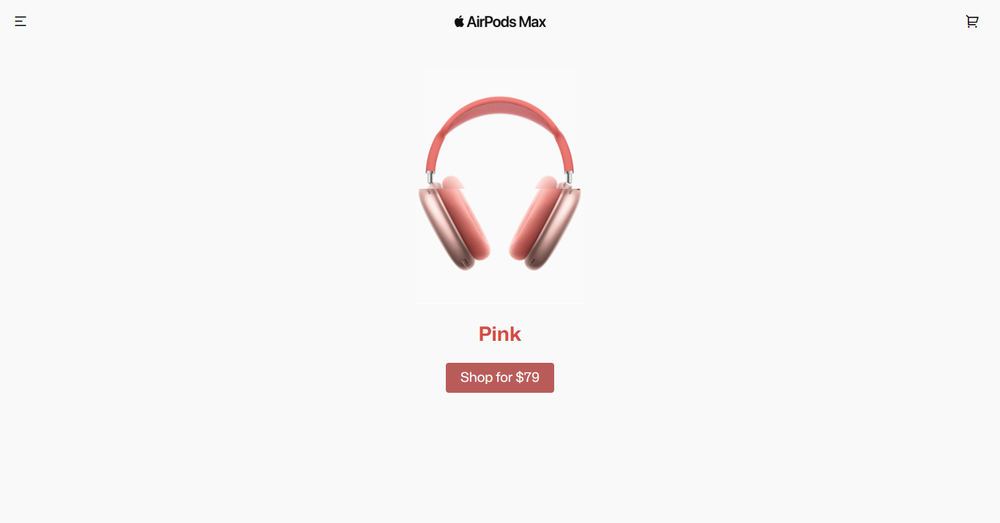

# AirPods Max Carousel

This project showcases an interactive carousel for Apple's AirPods Max headphones. The carousel allows users to explore different color variations of the AirPods Max headphones, view their features, and access purchasing options. The project consists of an HTML file, a CSS file, and a JavaScript file.

## Getting Started

To get started with this project, clone the repository or download the necessary files.

### Prerequisites

- Web browser

### Installation

1. Clone the repository:
   git clone https://github.com/your-username/airpods-max-carousel.git

2. Open the index.html file in your web browser.

## Usage

The project provides an interactive carousel that showcases the AirPods Max headphones. Here's a breakdown of the main files:

- index.html: Contains the HTML structure and content of the project, including the carousel container, headphone cards, and purchase buttons.
- style.css: Defines the styles and layout of the project, including the carousel, card animations, and button styles.
- script.js: Includes JavaScript code to handle the carousel functionality, such as rotating through the headphone cards and updating the content dynamically.

The project currently showcases three color variations of the AirPods Max headphones: Silver, Space Gray, and Sky Blue. Each card displays the respective headphone image, color name, and a "Buy Now" button.

You can customize the project by adding more color variations or modifying the content of the cards to match your needs. You can also enhance the styling or add additional features based on your preferences.

## Credits

- The AirPods Max images used in this project are for demonstration purposes only and are the property of Apple Inc.
- The project was inspired by Apple's product showcase design and aims to demonstrate web development skills.

## License

This project is licensed under the MIT License. Feel free to use, modify, and distribute the code as per the terms of the license.

## Acknowledgments

- Special thanks to the creators of GSAP for providing a powerful animation library.
- The project is developed solely for educational and demonstration purposes.

---

**Note:**

If you use this code or find it helpful, I would appreciate if you could send me an email at sanchitdogra5@gmail.com, sharing how you utilized it. I would love to know about your project and how this code contributed to it.
